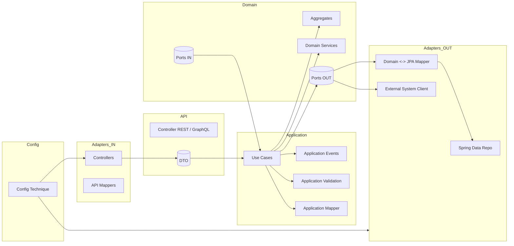

# Architecture Complète — DDD + Hexagonal + Clean Architecture

Ce document présente une architecture Java/Spring Boot complète reposant sur :

- **Domain‑Driven Design (DDD)**
- **Hexagonal Architecture (Ports & Adapters)**
- **Clean Architecture**

Objectifs :  
➡️ *Isoler le métier*  
➡️ *Rendre l’application testable et maintenable*  
➡️ *Indépendance technique (framework, DB, API externes)*

---
# 📦 Structure globale
```
src/main/java/com/example/<application-name>
├── domain
├── application
├── adapter
└── config
```
Chaque couche a un rôle **strict**, et les dépendances vont **de l’extérieur vers le domaine**, jamais l’inverse.

---
# 1️⃣ DOMAIN — Cœur du métier (DDD)
```
domain
└── <module>
    ├── model
    ├── service
    └── port
        ├── in
        └── out
```
## 🎯 Objectifs du domain
- Logique métier pure
- Modèles métiers stables
- Aucun framework

### 📁 `model`
Contient :
- Aggregates
- Entities
- Value Objects
- Domain Events
- Règles métier
- Invariants

❌ *Aucune annotation (@Entity, @Service…)*  
❌ *Aucune dépendance technique*

### 📁 `service`
Domain Services = logique métier transversale.

### 📁 `port/in`
Ports IN = **cas d’usage métier** (interfaces)

### 📁 `port/out`
Ports OUT = dépendances externes.

---
# 2️⃣ APPLICATION — Orchestration des Cas d’Usage
```
application
└── <module>
    ├── usecase
    ├── mapper
    ├── validation
    ├── event
    ├── handler
    ├── exception
    └── service
```
## 🎯 Objectifs
- orchestrer
- valider (applicatif)
- transactions
- sécurité/contextes
- appeler ports OUT
- publier events applicatifs

❌ aucune logique métier profonde

### 📁 `usecase`
Implémentation des ports IN.

### 📁 `mapper`
Mapping application ↔ domain.

### 📁 `validation`
Validation applicative (pas métier).

### 📁 `event`
Évènements applicatifs (≠ Domain Events).

### 📁 `handler`
Traitement des events applicatifs.

### 📁 `exception`
Exceptions applicatives.

### 📁 `service`
Services applicatifs (techniques).

---
# 3️⃣ ADAPTER — Ports & Adapters (Hexagonal)
```
adapter
├── in
└── out
```

## 🔹 adapter/in — Adaptateurs entrants
```
adapter/in/web/<module>
├── controller
├── dto
└── mapper
```
### controller
Expose l’application : REST / GraphQL / Messaging inbound

### dto
Objets d’entrée/sortie

### mapper
Anti‑Corruption Layer (API ↔ Domain)

---
## 🔹 adapter/out — Adaptateurs sortants
### persistence
```
adapter/out/persistence/<module>
├── entity
├── repository
└── adapter
```
- `entity` : entités JPA
- `repository` : Spring Data
- `adapter` : implémentation ports OUT (mapping, exceptions, orchestration)

### system
```
adapter/out/system/<integration>
├── client
└── adapter
```
Clients HTTP, MQ, FileSystem…

---
# 4️⃣ CONFIG — Configuration Technique
```
config
├── web
├── security
├── persistence
└── common
```
❗ Pas de logique métier

---
# 📊 Diagramme global — Architecture complète


---
# 🎯 Règles d’or
| Couche | Contient | Ne contient pas |
|--------|----------|----------------|
| Domain | métier | technique |
| Application | orchestration | métier |
| Adapter/in | exposition | logique |
| Adapter/out | technique | métier |
| Config | configuration | logique |

---
# 🏁 Document complet
Fin du document.
